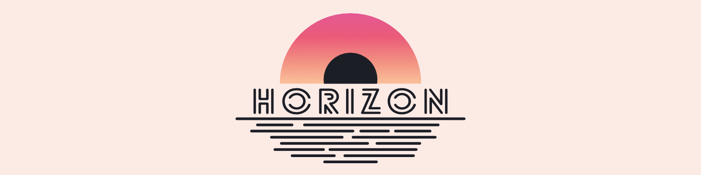
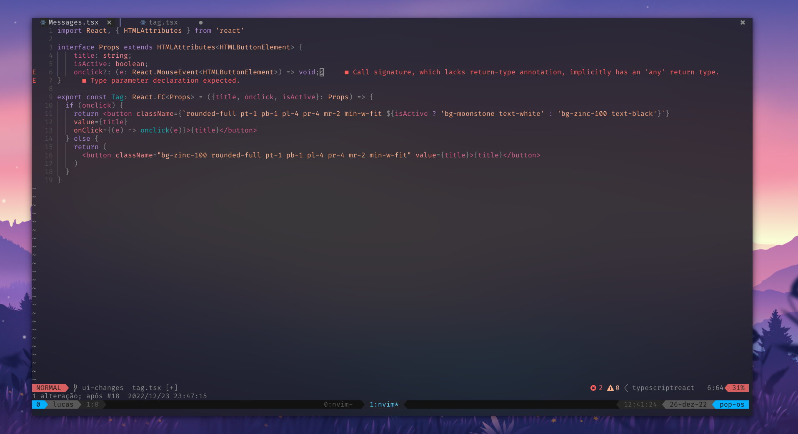
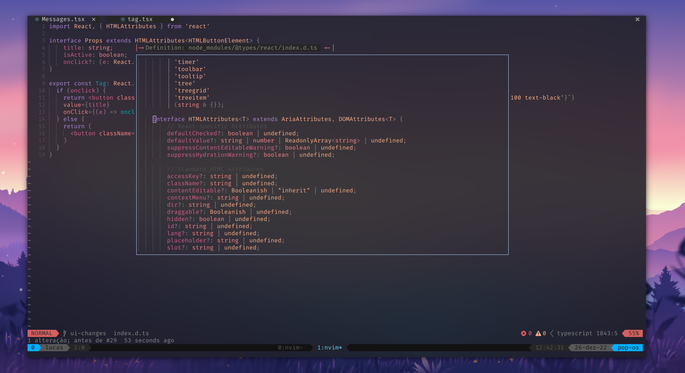

 

Created with [colorgen-nvim](https://github.com/ChristianChiarulli/colorgen-nvim)

## Installation

```lua
use "slenderb13/transparent-horizon.nvim"

vim.cmd[[colorscheme horizon]] 
```

## Demo

 
 

## Credit & References

[horizon-theme](https://github.com/jolaleye/horizon-theme-vscode)
